CUDA Path Tracer
================

**University of Pennsylvania, CIS 565: GPU Programming and Architecture, Project 3**

* David Liao
* Tested on: Tested on: Windows 7 Professional, Intel(R) Xeon(R) CPU E5-1630 v4 @ 3.70 GHz 3.70 GHz, GTX 1070 8192MB (SIG Lab)

## Monte Carlo Path Tracing
The path tracer uses Monte Carlo techniques to sample the scene. The camera fires a number of rays through each pixel to gather information about the scene through "hitting" and bouncing off objects. Each ray bounce is randomized with respect to the material and object it intersects with and accumulates information from each interaction. At the end, a sum of the ray information is taken and averaged. As a result, the initial iterations through the image might not be complete and thus "noisy" as shown in the example above.

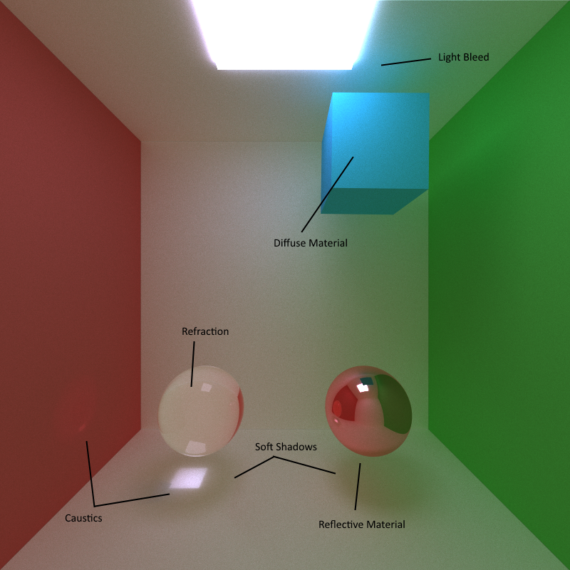
## Materials
We have three primary material types: diffuse, reflective, and refractive. The cube is diffuse and bounces rays based on naive normal-hemisphere sampling, which naturally biases towards the top of the hemisphere. The glass sphere has a refractive index of 1.4 and refracts light based on Snell's law. Finally, a pink-shaded sphere in the bottom right is fully reflective and captures all of the details that I mention below. 

### Light Bleeding, Caustic Light, Soft Shadows (The freebies!)
The benefits of using Monte Carlo methods are getting free caustic lights from refractive materials and realistic light bleeding. Caustic lights are caused by bent and focused (or dispersed) light passing through refractive materials. Depending on the index of refraction, you will get a different caustic pattern. Light bleeding comes from light bouncing off diffuse materials and having color that spills onto another surface. Finally, because we are stochastic in nature, we get soft shadows for free. 

### Realistic Refractions
Snell's Law:

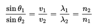

Schlick's Approximation:

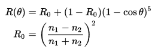

As light passes through a refractive material, it will distort according to laws of optics (Snell's Law). The Fresnel equations predicts an additional quality of light and how it reflects depending on its contact angle. As a result, you get a more realistic representation of refractive materials. In order to calculate this angle of reflection, Schlick's approximation for the Fresnel equations is a quick approximation that I used to render the images below.
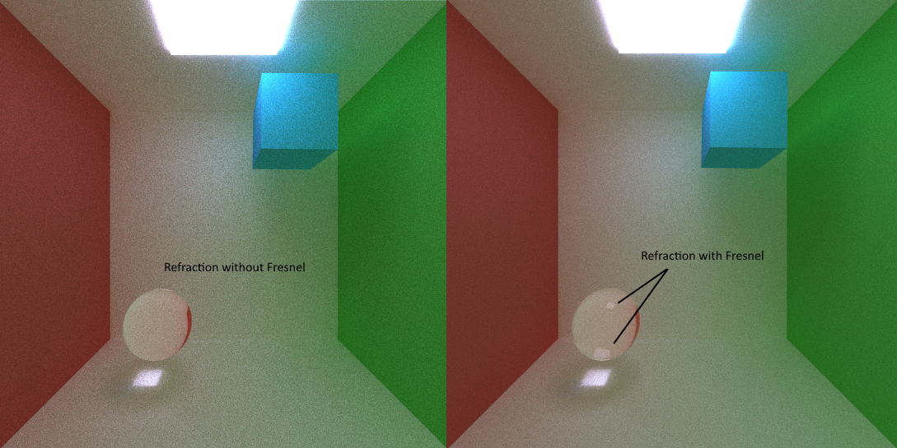

### Spatial Anti-Aliasing
Monte Carlo Path-tracing allows us to perform anti-aliasing for free (we average all samples anyways) and all we need to do is jitter the rays. We stochastically super-sample each pixel (offsetting the ray-pixel intersection point with noise) and perform our tracing operation as usual. In doing so, we avoid images with hard-edges as an artifact of the resolution that we are sampling at. Instead, we get nice smoothed edges. It is also important to note that Anti-aliasing makes some optimizations more tricky. In our case, we would like to cache our first bounce and reuse that information. Stochastic sampling makes so that initial bounces are not likely reusable. We can instead use more traditional deterministic techniques that fixes sub-pixel sampled points and caches those initial bounces. We would also incur high memory usage since we're required to cache more information.

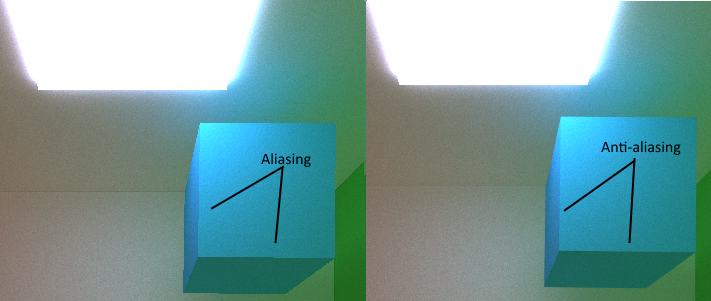

### Motion Blur (Temporal Anti-Aliasing)
Temporal Aliasing makes images with objects in motion "stutter" or flicker. Temporal Anti-aliasing removes this by sampling a scene parameterized by a time value. By providing a parameterized scene, we can have rays shot out with a random time sample attached to it (stochastic supersampling in the time dimension). This gives for images that seem to be moving with a blur (aftershadow). Like with spatial anti-aliasing, supersampling in time prevents us from caching our initial bounces unless we deterministically sample points along an interval that we re-use. Note that the scene files have been augmented by an `ANIMER` and `ANIMET` for the purpose of animating these objects (motion blur). Each scene file describes it's current location and the animated rotation and translation that it underwent to get to its current location. The path tracer then renders it in one timestep (by sampling all interpolated states in between).

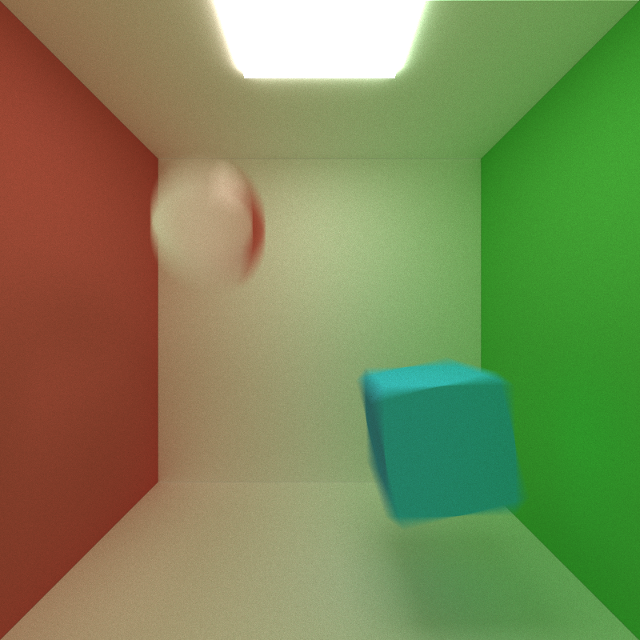

### Batch Rendering
To obtain the animation above, I wrote two scripts to generate the scenes and to automate the rendering of each scene. A python script parsed through a base scene description file and outputted keyframe scene files that interpolated the location between target endpoints. A bash script then automates the pathtracer to render each of these keyframed scene files. The final images are compiled in Photoshop into a gif.

## Performance Analysis

### Stream Compaction
Stream compaction is most useful when rays bounce out of the scene and are no longer relevant. It doesn't make sense to pass through rays that are already terminated. As a result, stream compaction is really useful on open scenes where rays can will bounce and hit nothing. The chat below graphs the number of rays after each bounce in a single iteration. We clearly see a sharp decrease in the number of rays that we have to process up till the very last bounce (max bounce of 8 in our case). 

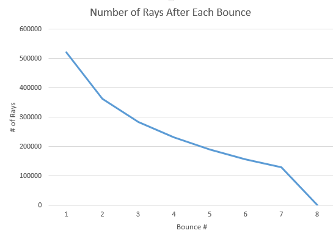 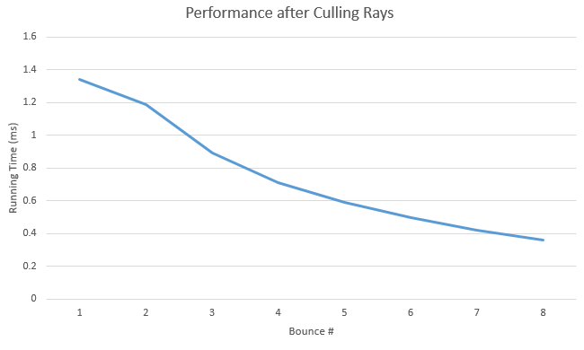

However, in a scene where the camera is within a closed room, we might take a performance hit since we can't cull as many rays. Most rays only terminate when they hit the light source or floating point error out of the room. We can see the performance take a hit in the chart below where not many rays are culled after each bounce. 

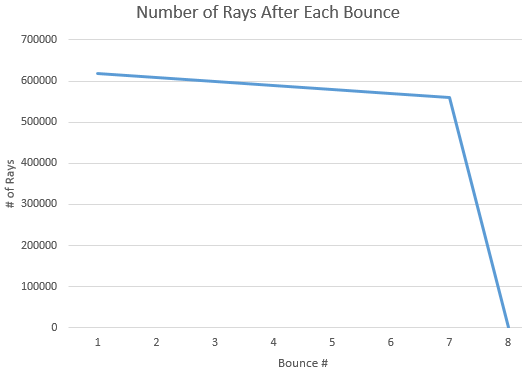 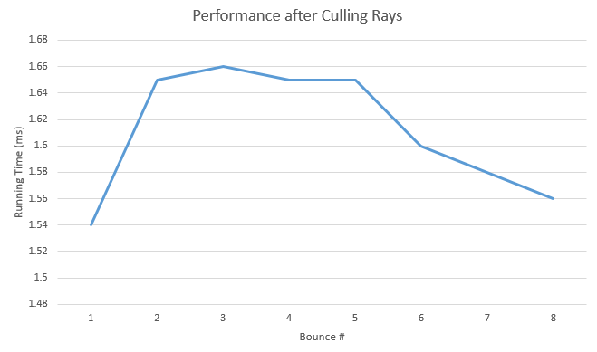

### Kernel Optimizations
The below chart is obtained on a standard cornell room `(/scenes/cornell2.txt)` and only the first bounce is inspected on NSight. Baseline is the pathtracer without any optimizations. Note that for all measurements using NSight, the running times are not representative of the true running times since a debugger is attached.
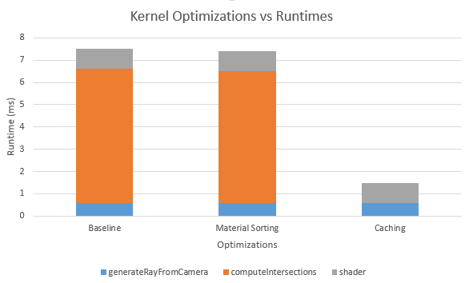

the below chart is based on the same scene and only the first iteration is inspected on NSight.
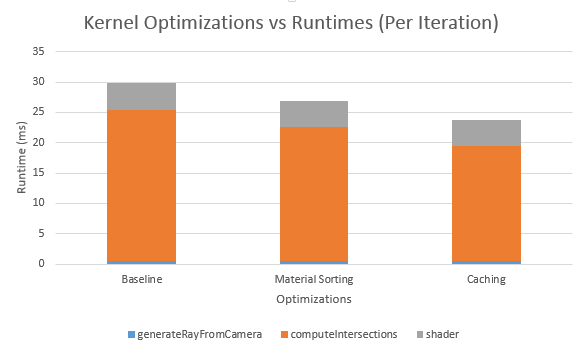

### Grouping by Material
The idea behind sorting all materials is to optimize for large scenes with high material variance. In this case, as we bounce rays, by grouping our rays with the same materials together, we have less stalls when computing material interactions. If they were the same material, kernels that shade them will deal with much less stalls due to branching. We can see that there's an slight speedup in our `computeIntersections` kernel function from sorting the materials. Blocks that launch on rays with the same materials will observe this speedup due to physical locality. However, in practice, with lower material counts, we hit performance costs for just sorting. Refer to the above chart for breakdown of performance (data obtained by NSight).

### Caching Initial Ray
The initial ray out of the camera at every iteration is the same (Unless temporal or spatial anti-aliasing is used). Thus we do not need to compute this ray intersection every iteration and we can reuse the first one computed. The performance increase is only horizontal across iterations (but not bounces). Refer to the above chart for breakdown of performance.

### Block Sizes
We empirically determined that 128 was the best block size. It seems that small block sizes suffer from some sort of overhead due to launching them. Large block sizes on the other hand have a higher probability of becoming stalled due to rays intersecting different materials (see Grouping by Material). The chart below describes the data captured by NSight on baseline pathtracer implementation using the scene `(/scenes/cornell`.txt)`. 

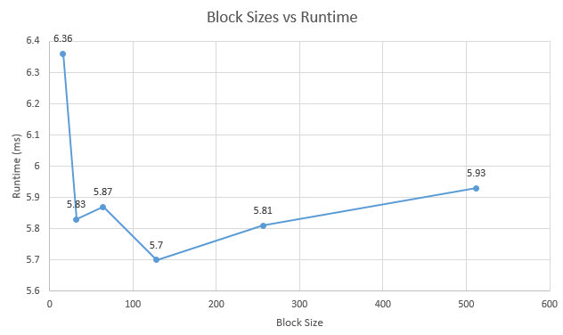

### Floating Point Errors
An epsilon value of 1e-3 was used in this path tracer for ray intersections. This is to offset from the origin of the new array in the direction it bounces to. The reason we do this is to prevent a material from hitting itself constantly (in the case of refractive materials) and to ensure floating point errors dont bring you to the other side of a surface. The following images ocurred as a result of not using an epsilon offset as well as using too small of an offset.

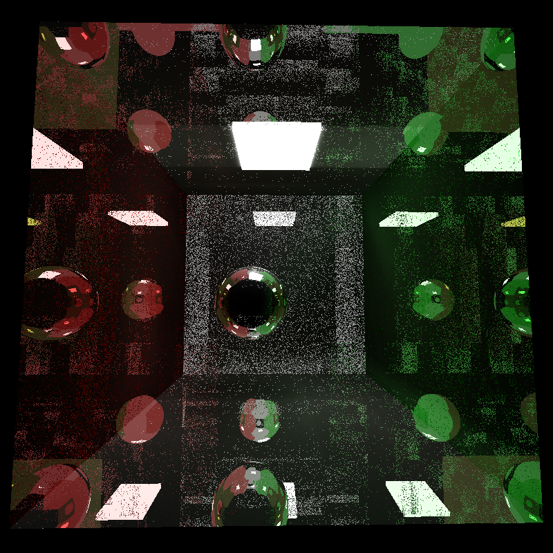

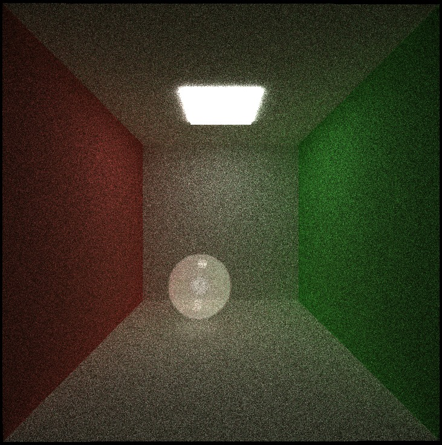
